# Java 课程知识点

[TOC]

## [概述](https://docs.oracle.com/javase/tutorial/getStarted/intro/index.html)

1. `Java` 发展历史：

   ① 1990 年代初由 `Sun` 公司开发，最初被命名为 `Oak`，用于家用电器；

   ② 1995 年，`Sun` 改造了 `Oak`，以 `Java` 的名称正式发布，广泛应用于互联网。

2. `J2ME`、`J2SE`、`J2EE`：

   `J2ME`：**J**ava **2** Platform, **M**icro **E**dition，应用于嵌入式（embedded）及移动设备（mobile device）；

   `J2SE`：**J**ava **2** Platform, **S**tandard **E**dition，应用于桌面（desktop）及服务器（server）环境；

   `J2EE`：**J**ava **2** Platform, **E**nterprise **E**dition，应用于分布式计算（distributed computing）及网络服务（web services），是 `J2SE` 的拓展。

3. `Java` 语言的特点：

   开放、简单、健壮、安全、面向网络、完全的面向对象编程（OOP）、跨平台（`WORA`）；

   > **`WORA`**：**W**rite **O**ne, **R**un **A**nywhere

4. `Java` 与 `C++` 的比较：

   ① `Java` 无**指针**；

   ② `Java` 无**结构体**和**联合体**；

   ③ `Java` 无**运算符重载**；

   ④ `Java` 无**多重继承**，以**接口（`interface`）**取代；

   ⑤ `Java` 无**头文件**和**预处理**；

   ⑥ `Java` 无 **`goto`** 关键字；

   ⑦ `Java` 有 **`GC`（Garbage Collection，垃圾回收）**；

5. `JVM`、`JRE`、`JDK` 的区别与联系：

   `JVM`：**J**ava **V**irtual **M**achine（`Java` 虚拟机），是执行 `Java` 字节码的虚拟机，能够执行编译后 `Java` 语言编写的程序；

   `JRE`：**J**ava **R**untime **E**nvironment（`Java` 运行时），包含了 `JVM`，和标准类库（Class Library），用户需要安装 `JRE` 来运行 `Java` 程序；

   `JDK`：**J**ava **D**evelopment **K**it（`Java` 开发工具包），包含了 `JRE`，开发者需要安装 `JDK` 来编译、调试 `Java` 程序。

6. `Java` 源代码（`.java` 文件）由编译器（`javac`）编译为字节码（`.class` 文件）再由解释器（`java`）执行。

7. 一份 `Java` 源代码可以包含多个类的定义，但仅能有一个 `public` 修饰的类，且文件名须与此类一致。

8. `Java` 的编译器：`javac`，解释器：`java`。

9. [`PATH` 和 `CLASSPATH`](https://docs.oracle.com/javase/tutorial/essential/environment/paths.html)：

   `PATH` 中应包含 `Java` 的编译器、解释器等可执行程序；

   `CLASSPATH` 中应包含除标准类库外所需的类的路径（包含当前路径 `.`）。

10. 包的定义：`package`；

    包的导入：`import`。

## Java 的语法

11. [标识符的命名](https://docs.oracle.com/javase/tutorial/java/nutsandbolts/variables.html)：

    一个合法的标识符应当是一个：**以 `Unicode` 字符、`$` 字符或 `_` 字符开头**，由 **`Unicode` 字符和数字**组成的，**不限长度**的，**从未被使用过**的字符序列。

    **注意**：一个合法的标识符不应是**关键字**、**保留字**（`const`、`goto`）或**字面量**（`true`、`false`、`null`）。

12. `Java` 的数据类型：

    [`Java` 的原始数据类型](https://docs.oracle.com/javase/tutorial/java/nutsandbolts/datatypes.html)（`byte`、`short`、`int`、`long`、`float`、`double`、`boolean`、`char`）、[`Java` 的数组](https://docs.oracle.com/javase/tutorial/java/nutsandbolts/arrays.html)、[`Java` 的类](https://docs.oracle.com/javase/tutorial/java/javaOO/classes.html)、[`Java` 的接口](https://docs.oracle.com/javase/tutorial/java/IandI/createinterface.html)、[`Java` 的枚举类型](https://docs.oracle.com/javase/tutorial/java/javaOO/enum.html)、[`Java` 的枚举类型](https://docs.oracle.com/javase/tutorial/java/javaOO/enum.html)、[`Java` 的枚举类型](https://docs.oracle.com/javase/tutorial/java/javaOO/enum.html)、[`Java` 的枚举类型](https://docs.oracle.com/javase/tutorial/java/javaOO/enum.html)。

13. `Java` 中的 `char` 类型使用 `2` 字节的 `Unicode` 编码。

14. `Java` 中 `8` 个原始数据类型对应着 `8` 个类型的封装。

15. `Java` 中的字符串类：`String`、`StringBuffer`；

    `String` 的典型方法：`equals()`、`indexOf()`。

16. `Java` 中的类型转换，遵循[里氏替换原则](https://zh.wikipedia.org/wiki/里氏替换原则)，精度损失视为错误。
17. [`Java` 中的数组](https://docs.oracle.com/javase/tutorial/java/nutsandbolts/arrays.html)，拥有内置的（built-in）`length` 属性。
18. [`Java` 控制流中的分支语句](https://docs.oracle.com/javase/tutorial/java/nutsandbolts/branch.html)：`break`、`continue` 可以控制带有标号的控制语句。
19. 参考 PPT 中生成随机数数组的例题（* 也可参考 Java Tutorial 中的例子）。

## [面向对象编程](https://docs.oracle.com/javase/tutorial/java/concepts/index.html)

20. 面向对象编程（OOP）的三大特征：**继承**、**封装**、**多态**

21. [类的声明](https://docs.oracle.com/javase/tutorial/java/javaOO/classdecl.html)、[成员变量的声明](https://docs.oracle.com/javase/tutorial/java/javaOO/variables.html)、[方法的定义](https://docs.oracle.com/javase/tutorial/java/javaOO/methods.html)

22. [静态成员（类变量、类方法）](https://docs.oracle.com/javase/tutorial/java/javaOO/classvars.html)

    不被推荐（discouraged）但正确的类方法的调用：`instanceName.methodName(args)`

23. [构造方法](https://docs.oracle.com/javase/tutorial/java/javaOO/constructors.html)：

    ① 与类同名；② 无返回值；③ 由关键字 `new` 调用；④ 可重载，但每两个重载的构造方法不应当**同时**有相同数量、相同类型且相同顺序的参数（确保无歧义）；⑤ 若未定义构造方法，编译器将默认提供一个无参的构造方法。

    **注意**：构造方法不是成员。

24. [访问控制](https://docs.oracle.com/javase/tutorial/java/javaOO/accesscontrol.html)：

    | Modifier    | Class | Package | Subclass | World |
    | ----------- | ----- | ------- | -------- | ----- |
    | `public`    | Y     | Y       | Y        | Y     |
    | `protected` | Y     | Y       | Y        | N     |
    | no modifier | Y     | Y       | N        | N     |
    | `private`   | Y     | N       | N        | N     |

25. [继承](https://docs.oracle.com/javase/tutorial/java/IandI/subclasses.html)：

    ① 除了没有父类的 `Object` 类，每一个类都**有且只有一个**父类（单重继承）；

    ② `Object` 类是所有类的隐式（implicitly）父类；

    ③ 子类将继承一切父类公有（public）或保护（protected）的成员（包括：属性（fields）、方法（methods）、嵌套类（nested classes））。

    **注意**：① 构造方法不是成员，故而不被子类继承，但可以被子类调用；② 嵌套类（nested class）可以访问其外部类的所有私有成员，因而子类可以通过其间接访问父类的成员。

26. 重载（Overload）与[重写（Override）](https://docs.oracle.com/javase/tutorial/java/IandI/override.html)

    重载：重载的方法具有**相同**的方法名，**不同**的**参数数量、类型或顺序**

    重写：重写的方法具有**相同**的**方法名**、**参数的数量、类型**和顺序与相同或为其子类的**返回类型**。

27. 关键字 `this` 和 `super`

    [`this` 关键字](https://docs.oracle.com/javase/tutorial/java/javaOO/thiskey.html)：用于区分自身属性和外部参数；

    [`super` 关键字](https://docs.oracle.com/javase/tutorial/java/IandI/super.html)：用于重写时区分父类与子类的参数。

28. [方法重写的原则](https://docs.oracle.com/javase/tutorial/java/IandI/override.html)：

    要满足[里氏替换原则](https://zh.wikipedia.org/wiki/里氏替换原则)，因而有 ① 访问权限不应比父类更严格；② 抛出的异常不应比父类更多。

29. [多态](https://docs.oracle.com/javase/tutorial/java/IandI/polymorphism.html)：运行时多态、编译时多态。

30. 运行时多态的两个前提：① 上溯造型；② 方法重写

31. `final` 关键字：

    修饰变量：不可被**修改**，为常量；

    修饰方法：不可被**重写**；

    修饰类：不可被**继承**；

## [抽象](https://docs.oracle.com/javase/tutorial/java/IandI/abstract.html)

32. [抽象（`abstract` 关键字）](https://docs.oracle.com/javase/tutorial/java/IandI/abstract.html)，可以修饰类和方法，也可修饰接口，但那是不必要的（unnecessary）。
33. 抽象类：`abstract` 关键字修饰的类，不能实例化。
34. 抽象方法：`abstract` 关键字修饰的方法，没有实现。
35. 抽象类中有**任意数量**的抽象方法和**任意数量**的非抽象方法。
36. 非抽象方法可以调用抽象方法（只有 `abstract` 关键字修饰的类拥有抽象方法）。
37.  非抽象子类应当实现继承的抽象父类的所有抽象方法和抽象父类的未实现的接口（只有 `abstract` 关键字修饰的类拥有抽象方法）。
38. 抽象类存在的必要性：通过抽象方法规定子类必须完成的方法（动作）。

## [接口](https://docs.oracle.com/javase/tutorial/java/IandI/createinterface.html)

39. [接口（`interface` 关键字）](https://docs.oracle.com/javase/tutorial/java/IandI/createinterface.html)，只包含常量（constants）和抽象方法（* 实际上还有方法签名（method signatures）、默认方法（default methods）。

    实现（`implements` 关键字）。

40. 接口中的常量无需修饰，默认为 `public static final`；方法亦无需修饰，默认为 `public abstract`。

41. 一个类可以实现多个接口，接口也可以实现接口。

42. 非抽象类应当实现接口的所有方法（* 实际上 `default` 关键字修饰的无需实现）。

## [内部类](https://docs.oracle.com/javase/tutorial/java/javaOO/nested.html)

**注意**：内部类（inner class）不是静态嵌套类（static nested class）

① 内部类不能有 `static` 修饰的成员（属性、方法）。

② 内部类可以访问外部类的所有成员。

## [系统类](https://docs.oracle.com/javase/tutorial/essential/index.html)

43. `Object` 类是所有类的父类（间接父类）。

44. [`Object` 类](https://docs.oracle.com/en/java/javase/17/docs/api/java.base/java/lang/Object.html)：

    `Object::equals(Object obj)`：是否是同一个对象（地址相同）；

    `Object::getClass()`：获取对象的**运行时类**；

    `Object::toString()`：转换为字符串，相当于 `getClass().getName() + '@' + Integer.toHexString(hashCode())`。

45. [`String` 类](https://docs.oracle.com/en/java/javase/17/docs/api/java.base/java/lang/String.html)：

    `String::equals(Object obj)`：当且仅当 `obj` 参数不为 `null`、类型为 `String` 且所存储的字符序列相同时返回 `true`（* 也就是该方法的参数不必须是一个 `String`）。

    `String::length()`：返回字符串的长度，这是一个**方法**，注意与数组的 `length` **属性** 区分。

    `String::compareTo(String anotherString)`：顺序为**字典序**；若前置字符均相同，则短字符串排于长字符串之前。

46. 原始数据类型与 `String` 中的转换：

    原始数据类型转换为 `String`：使用 [`String.valueOf()` 方法](https://docs.oracle.com/en/java/javase/17/docs/api/java.base/java/lang/String.html#valueOf(boolean)) 或用加法运算符；

    `String` 转换为原始数据类型：使用如 `Integer.parseInt` 式的方法。

47. [`Vector` 列表](https://docs.oracle.com/en/java/javase/17/docs/api/java.base/java/util/Vector.html)和 [`ArrayList` 列表](https://docs.oracle.com/en/java/javase/17/docs/api/java.base/java/util/ArrayList.html)：`Vector` 是**线程安全（thread-safe）**的，但如果线程安全不是必须，更推荐使用 `ArrayList`。

## [异常处理](https://docs.oracle.com/javase/tutorial/essential/exceptions/index.html)

48. [异常处理的基本概念](https://docs.oracle.com/javase/tutorial/essential/exceptions/definition.html)，[异常处理的优势](https://docs.oracle.com/javase/tutorial/essential/exceptions/advantages.html)。

49. `JVM` 中的运行时错误和 `Java` 的异常类的对应关系：由 `JVM` 对应。

50. PPT 中关于异常的图。

    

51. `Java` 中的异常类：

    

    [运行时异常](https://docs.oracle.com/javase/tutorial/essential/exceptions/runtime.html)（`RuntimeException` 及其子类，又称 `unchecked Exception`）：编译器将不会检查异常的捕获情况（* **PPT 中认为**运行时异常一定是程序的错误）。

    > If a client can reasonably be expected to recover from an exception, make it a checked exception. If a client cannot do anything to recover from the exception, make it an unchecked exception.

52. [异常的处理方法](https://docs.oracle.com/javase/tutorial/essential/exceptions/handling.html)：

    ① `try-catch-finally` 捕获异常；

    ② 使用 `throws` 关键字，不进行处理。

53. [`throws` 关键字](https://docs.oracle.com/javase/tutorial/essential/exceptions/declaring.html)：指定（specify）一个方法**可能**抛出的所有异常，非运行时异常可以不被指定；

    [`throw` 关键字](https://docs.oracle.com/javase/tutorial/essential/exceptions/throwing.html)：抛出的是一个 `Throwable` 对象。

## [输入输出流](https://docs.oracle.com/javase/tutorial/essential/io/index.html)

54. 输入输出流的四个抽象类：

    ① [`InputStream` 抽象类](https://docs.oracle.com/en/java/javase/17/docs/api/java.base/java/io/InputStream.html)：以字节（byte）为单位进行输入；

    ② [`OutputStream` 抽象类](https://docs.oracle.com/en/java/javase/17/docs/api/java.base/java/io/OutputStream.html)：以字节（byte）为单位进行输出；

    ③ [`Reader` 抽象类](https://docs.oracle.com/en/java/javase/17/docs/api/java.base/java/io/Reader.html)：以字符（character）为单位进行输入；

    ④ [`Writer` 抽象类](https://docs.oracle.com/en/java/javase/17/docs/api/java.base/java/io/Writer.html)：以字符（character）为单位进行输出。

55. 能够用字节流、字符流编写文件的拷贝程序。
56. [`File` 类](https://docs.oracle.com/en/java/javase/17/docs/api/java.base/java/io/File.html)：`File::File(String pathname)`。
57. [`InputStreamReader` 类](https://docs.oracle.com/en/java/javase/17/docs/api/java.base/java/io/InputStreamReader.html)、[`OutputStreamWriter` 类](https://docs.oracle.com/en/java/javase/17/docs/api/java.base/java/io/OutputStreamWriter.html)。
58. [`BufferedReader` 类](https://docs.oracle.com/en/java/javase/17/docs/api/java.base/java/io/BufferedReader.html)、[`BufferedWriter` 类](https://docs.oracle.com/en/java/javase/17/docs/api/java.base/java/io/BufferedWriter.html)。

## [多线程](https://docs.oracle.com/javase/tutorial/essential/concurrency/procthread.html)

59. 继承 `Thread` 类或实现 `Runnable` 接口来完成多线程。

60. 多线程的四种状态图，参考 PPT（* `stop()` 已经[**废弃（Deprecated）**](https://docs.oracle.com/en/java/javase/17/docs/api/java.base/java/lang/Thread.html#stop())了）。

61. 编写多线程程序的两种方法：

    ① 继承 `Thread` 类，重写 `run()` 方法。

    ② 实现 `Runnable` 接口，并通过其构造一个 `Thread` 类。

62. [锁和同步](https://docs.oracle.com/javase/tutorial/essential/concurrency/locksync.html)。
63. [`Thread.sleep(long millis)` 方法](https://docs.oracle.com/en/java/javase/17/docs/api/java.base/java/lang/Thread.html#sleep(long))、[`Thread.currentThread()` 方法](https://docs.oracle.com/en/java/javase/17/docs/api/java.base/java/lang/Thread.html#currentThread())。

## [网络编程](https://docs.oracle.com/javase/tutorial/networking/index.html)

64. [`URL` 类](https://docs.oracle.com/javase/tutorial/networking/urls/index.html)，[`URL` 类读写](https://docs.oracle.com/javase/tutorial/networking/urls/readingWriting.html)。
65. [`Socket` 类通信](https://docs.oracle.com/javase/tutorial/networking/sockets/definition.html)。

## [GUI 编程](https://docs.oracle.com/javase/tutorial/uiswing/index.html)

66. [各类组件](https://docs.oracle.com/javase/tutorial/uiswing/components/index.html)。

67. [`Frame` 容器](https://docs.oracle.com/javase/tutorial/uiswing/components/frame.html)、[`Panel` 容器](https://docs.oracle.com/javase/tutorial/uiswing/components/panel.html)；

    `Windows`、`Frame` 容器的默认布局为 `BorderLayout`；

    `Panel`、`Applet` 容器的默认布局为 `FlowLayout`。

68. 容器的常用方法 `add()`、`setLayout()`、`setSize()`。
69. `AWT` 事件监听模型，参考 PPT。
70. `Button` 的消息响应：可以参考 Java Tutorial 中的[例子](https://docs.oracle.com/javase/tutorial/uiswing/components/button.html)。
